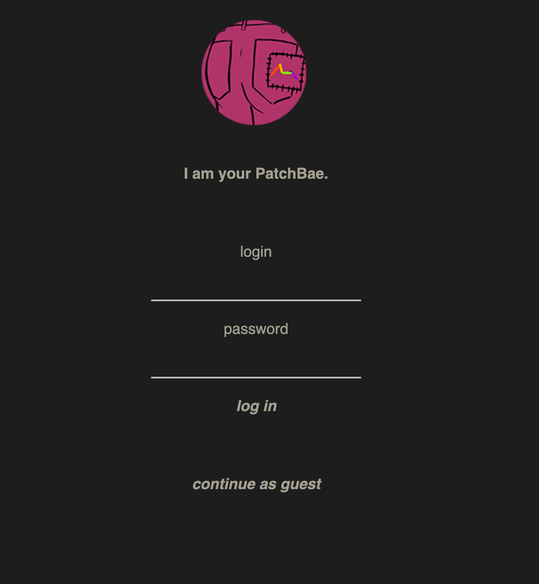
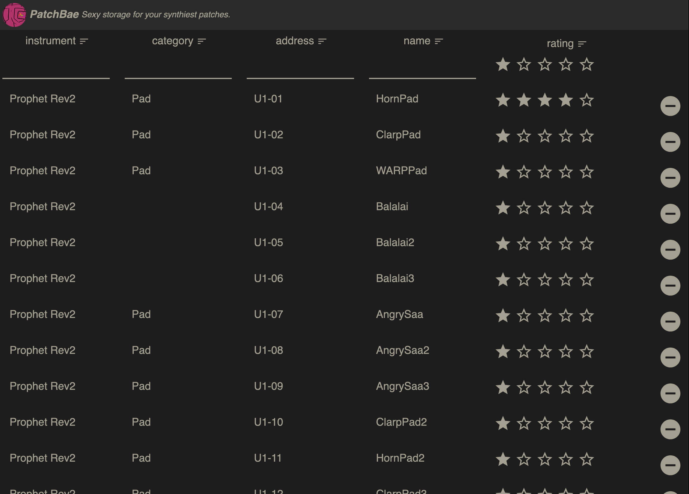

# patchbae
Like tracking your synth and drum machine patches in a spreadsheet, but filter by tags, categories.

## see it in action
https://spectralliaisons.github.io/patchbae/

### Enter credentials to modify an existing table of patches or continue as guest to rely only on localStorage


### Table of patches


### Authentication

[Amazon Cognito](https://us-west-2.console.aws.amazon.com/cognito) authenticates the provided user login and password to have read/write access to DynamoDB, which stores a table of user patches. There is currently no ability for users to "sign up" or create their own accounts.

Users can bypass authentication by selecting "continue as guest," which will cache their data to localStorage.

### Usage

User patches are organized into a single table with the following columns:

#### Columns supported in the current implementation:

`Instrument`: Which device?

`Category`: What type of sound is this? (e.g. "lead", "pad", "kick", "snare", etc.)

`Address`: Where is it stored on the device? (e.g. "U4-P86")

`Name`: What is its saved name?

#### Columns to support in future versions:

Supporting the following columns will require a system for filtering rows to display by tags. The implementation must ensure that when a row is deleted, any rows that reference it as Family or Friend remove it.

`Family`: Variations of one root patch (list of Names for this Instrument)

`Friends`: What sounds good together? (list of Names for this Instrument)

## e.g.
Filter: [#     ]

Instrument | Category | Address | Name | Rating | Tags | Projects | Family | Friends|
|-|:-:|:-:|:-:|:-:|:-:|:-:|:-:|:-:|
| Prophet Rev2 | #pad | U4-P86 | Cine4 | * * * | #mellow #smooth #tinny #warble | #SongA | #Buum | # |
| Roland TR-8S | #kick | Kit-97 | Buum | * * | #deep #broad | #SongA #SongB | #Cine4 | #Snak |
| Roland TR-8S | #snare | Kit-97 | Snak | * * * * | #deep #broad | #SongC #SongD | # | #Buum |

## development

1. [Install Elm](https://guide.elm-lang.org/install/elm.html)

### Setting up a table for user data via Amazon DynamoDB

1. In [AWS Services > DynamoDB](https://us-west-2.console.aws.amazon.com/dynamodb), select "Create table" with Table name "Patchbae" and Primary key "UID". Use default settings. Click Create.

### Setting up Amazon Cognito to authenticate user access to data

Helpful resources: 
- [link](https://tutorialedge.net/projects/building-blog-with-vuejs-aws/part-5-getting-started-with-cognito/)
- [link](https://aws.amazon.com/blogs/mobile/building-fine-grained-authorization-using-amazon-cognito-user-pools-groups/)

1. In [AWS Services > Cognito](https://us-west-2.console.aws.amazon.com/cognito), create a User Pool and make sure "Generate client secret" is UNCHECKED. 

2. Create the pool and in Federated Identities > App integration > App client settings > Enabled Identity Providers, ensure "Cognito User Pool" is checked.

3. In Federated Identities > Identity Pool > Authentication providers > Cognito, set the appropriate User Pool ID and App client id.

4. In Authenticated Roles, select "Choose role from token" and Role resolution to "Use default Authenticated role", then click Save Changes.

5. Navigate to [IAM](https://console.aws.amazon.com/iam/home#/policies) > Policies > Create Policy and enter the following JSON policy:
```json
"Version": "2012-10-17",
    "Statement": [
        {
            "Effect": "Allow",
            "Action": [
                "dynamodb:GetItem",
                "dynamodb:PutItem",
                "dynamodb:Query"
            ],
            "Resource": [
                "arn:aws:dynamodb: <YOUR_REGION>:<YOUR_AWS_ACCOUNT_ID>:table/<YOUR DYNAMODB_TABLE>"
            ],
            "Condition": {
                "ForAllValues:StringEquals": {
                    "dynamodb:LeadingKeys": [
                        "${cognito-identity.amazonaws.com:sub}"
                    ]
                }
            }
        }
    ]
}
```

You can find <YOUR_AWS_ACCOUNT_ID> by running in the Terminal:
`aws sts get-caller-identity` and entering the value for "Account".

6. Attach the AmazonDynamoDBFullAccess policy to your Auth and Unauth Roles.

3. In General settings > Users and groups > Users, select "Create user" and create a user you with to authenticate with when logging in to Patchbae.

4. You'll need to change the password for the user you just created; to do this, you'll need to ensure aws cli is available in your Terminal:
`brew install awscli`

5. [Configure aws with your AWS admin](https://awscli.amazonaws.com/v2/documentation/api/latest/reference/cognito-idp/admin-set-user-password.html), replacing XXX with your values:
```
aws configure
aws cognito-idp admin-set-user-password --user-pool-id XXX --username XXX --password XXX --permanent
```

./src/js/elm-buddy.js authenticate() will now be able to retrieve an authentication token for the username and password entered in the command above!

2. Install Amazon Cognito with Node JS:
`npm install amazon-cognito-identity-js`

3. Create `./src/js/priv/cognitoConfig.js` for your Amazon Cognito Credentials and fill in your Identity, User Pool, & Client Ids with the values you just created:
```js
window.configureCognito = function () {
    return {
        region: XXX,
        IdentityPoolId: XXX,
        UserPoolId: XXX,
        ClientId: XXX
    };
};
```

## compiling

#### [elm-live](https://www.elm-live.com/)

1. Compile the Elm code into JavaScript with live editing: `elm-live src/Main.elm --open --start-page=index.html -- --output=elm.js`

2. Navigate to [http://localhost:8000](http://localhost:8000)

### production

Compile the project with optimization:

`sh optimize.sh src/Main.elm`