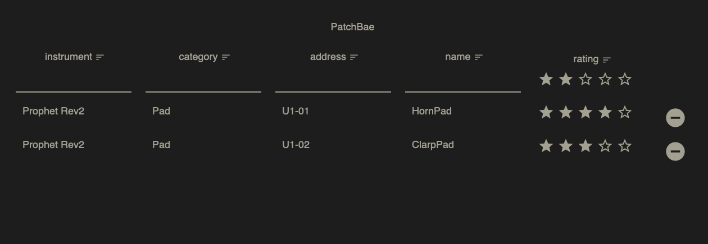

# patchbae
Like tracking your synth and drum machine patches in a spreadsheet, but filter by tags, categories.

Columns:
_Name_: What is its saved name?
_Instrument_: Which device?
_Address_: Where is it stored on the device?
_Family_: Variations of one root patch.

_Friends_: What sounds good together?

## recent screenshot

### e.g.
Filter: [#     ]

Instrument | Category | Address | Name | Rating | Tags | Projects | Family | Friends|
|-|:-:|:-:|:-:|:-:|:-:|:-:|:-:|:-:|
| Prophet Rev2 | #pad | U4-P86 | Cine4 | * * * | #mellow #smooth #tinny #warble | #SongA | #Buum | # |
| Roland TR-8S | #kick | Kit-97 | Buum | * * | #deep #broad | #SongA #SongB | #Cine4 | #Snak |
| Roland TR-8S | #snare | Kit-97 | Snak | * * * * | #deep #broad | #SongC #SongD | # | #Buum |
